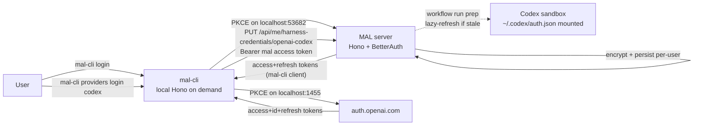

# Codex OAuth via mal-cli

## Context

Codex CLI uses subscription-priced inference only when started with an OAuth-issued `~/.codex/auth.json` file. The OAuth flow uses OpenAI's auth server with a *fixed* registered redirect URI of `http://localhost:1455/auth/callback` against `client_id=app_EMoamEEZ73f0CkXaXp7hrann`. Source verified at `openai/codex` `codex-rs/login/src/server.rs` (commit 9a8730f3).

Today's auth in MAL:

- [apps/server/src/harness/CodexCliHarness.ts](apps/server/src/harness/CodexCliHarness.ts) only knows about `OPENAI_API_KEY` (env-var path, API pricing).
- [apps/server/src/harness/HarnessAuthService.ts](apps/server/src/harness/HarnessAuthService.ts) returns a single `ProtectedString`.
- [apps/server/src/auth/auth.ts](apps/server/src/auth/auth.ts) uses Better Auth (magic-link only) for *user* identity. Workspace memberships in [apps/server/src/auth/WorkspaceMembershipsService.ts](apps/server/src/auth/WorkspaceMembershipsService.ts).
- Encrypted-secret pattern already exists at [apps/server/src/forge-secrets/ForgeSecretRepository.ts](apps/server/src/forge-secrets/ForgeSecretRepository.ts) using [apps/server/src/utils/EncryptionService.ts](apps/server/src/utils/EncryptionService.ts).
- SEA binary build template at [apps/driver/build-sea.mjs](apps/driver/build-sea.mjs), [apps/driver/moon.yml](apps/driver/moon.yml).

We will not bind port 1455 on the server (where it's a poor fit and a multi-user blocker). Instead the CLI handles all OAuth callbacks on the user's machine.

## Architecture




## Design Decisions

- **MAL is an OAuth 2.1 issuer** via `@better-auth/oauth-provider` + `jwt()` plugin. The `mal-cli` is pre-registered as a public client (`token_endpoint_auth_method: "none"`, PKCE/S256 enforced).
- **Per-user credential storage**, encrypted at rest with a NEW dedicated master key (`OAUTH_CREDENTIALS_ENCRYPTION_KEY`, distinct from `FORGE_ENCRYPTION_KEY`). Each row stores a per-record `keySalt` (base64, 16 bytes random); the actual encryption key is derived per-record via `HKDF-SHA256(master_key, salt, info="mal:oauth-credentials:v1") -> 32 bytes`, then used with AES-256-GCM and a fresh IV. This isolates each record's cryptographic material so a leaked record's key cannot decrypt others, and lets us rotate the master key in the future without touching the IV-format. Key: `(userId, providerId)`. Single row per user per provider; latest login wins.
- **Generic provider abstraction** with `OpenAiCodexProvider` as the only concrete provider in v1.
- **OAuth wins over env-var API key** when both are configured for `codex-cli`.
- **Workspace-creator-only resolution (v1)**: the workflow uses the OAuth credential of the user with the earliest `workspace_memberships.createdAt` for the workspace. Multi-user-credential semantics deferred.
- **Lazy refresh only**: server refreshes tokens at run-prep time if `last_refresh > 7 days`. No background job. No write-back from the running container.
- **CLI distribution**: SEA binary mirroring `apps/driver`. Local dev via `pnpm tsx`.
- **CLI local storage**: `${XDG_CONFIG_HOME:-~/.config}/mal-cli/auth.json`, mode `0600`.
- **CLI command shape**: nested noun, `mal-cli providers login codex` / `mal-cli providers logout codex`, plus top-level `mal-cli login` / `mal-cli logout` / `mal-cli status`.
- **Browser handling**: `open(url)` AND print URL to stdout for SSH/headless fallback.
- **Logout = delete only**, no provider revocation calls in v1.
- **No frontend UI** in v1 (deferred).

## Codex OAuth specifics (verified from `codex-rs/login/src/server.rs`)

- Authorize: `https://auth.openai.com/oauth/authorize` with params `response_type=code`, `client_id=app_EMoamEEZ73f0CkXaXp7hrann`, `redirect_uri=http://localhost:1455/auth/callback`, `scope=openid profile email offline_access`, `code_challenge`, `code_challenge_method=S256`, `state`, `id_token_add_organizations=true`, `codex_cli_simplified_flow=true`, `originator=codex_cli_rs`.
- Token: `POST https://auth.openai.com/oauth/token`, `Content-Type: application/x-www-form-urlencoded`, body `grant_type=authorization_code&code=...&redirect_uri=...&client_id=...&code_verifier=...`. Refresh uses `grant_type=refresh_token&refresh_token=...&client_id=...`.
- `auth.json` shape (Codex reads this in the sandbox): `{ "OPENAI_API_KEY": null, "tokens": { "access_token", "id_token", "refresh_token", "account_id" }, "last_refresh": "<ISO-8601>" }`. `account_id` is parsed from the access-token JWT claim `["https://api.openai.com/auth"].chatgpt_account_id`.

## Implementation Guide

### MAL server: become an OAuth issuer

- Install: `pnpm --filter @mono/server add @better-auth/oauth-provider` (and bump `better-auth` if required by the plugin).
- Edit [apps/server/src/auth/auth.ts](apps/server/src/auth/auth.ts) to add the `jwt()` plugin and `oauthProvider({ issuer, scopes, validAudiences, cachedTrustedClients: new Set(["mal-cli"]), loginPage, consentPage })`. Use `env.APP_BASE_URL + "/api/auth"` as the issuer.
- Add a minimal consent route (Hono static HTML at `/oauth/consent`) and login route already covered by magic-link flow.
- Mount `.well-known/oauth-authorization-server` and `.well-known/openid-configuration` per the plugin docs from [apps/server/src/index.ts](apps/server/src/index.ts).
- New `apps/server/src/auth/oauth-client-seed.ts` exporting `ensureMalCliClient()` that idempotently calls `auth.api.createOAuthClient({ ... })` with `client_id="mal-cli"`, `token_endpoint_auth_method="none"`, `redirect_uris=["http://localhost:53682/auth/callback"]`, scope `openid profile email offline_access`. Call once from [apps/server/src/index.ts](apps/server/src/index.ts) before `serve(...)`.
- New `apps/server/src/auth/oauth-bearer.ts` exporting `requireOAuthBearer(request)` that uses `verifyAccessToken` from `better-auth/oauth2` to resolve `Authorization: Bearer <jwt>` to a `UserId`. Distinct from existing cookie-based `requireAuthSession`.
- Schema: do NOT author migration SQL. Run `pnpm --filter @mono/server better-auth migrate` (or `generate`) and surface the schema diff for human review per [apps/server/AGENTS.md](apps/server/AGENTS.md).

### Storage and provider abstraction

- Add a NEW env var `OAUTH_CREDENTIALS_ENCRYPTION_KEY` to [apps/server/src/env.ts](apps/server/src/env.ts) (32-byte hex or base64, validated the same way `FORGE_ENCRYPTION_KEY` is). Document in `.env.local` examples and CI setup.
- Add `apps/server/src/utils/SaltedEncryptionService.ts` (new file). Reuses `node:crypto` directly:
  - Constructor takes the 32-byte master key buffer.
  - `encrypt(plaintext: string) -> { keySalt: string, payload: string }`:
    - Generate `salt = crypto.randomBytes(16)`.
    - `derivedKey = crypto.hkdfSync("sha256", masterKey, salt, Buffer.from("mal:oauth-credentials:v1"), 32)`.
    - Encrypt with AES-256-GCM, fresh 12-byte IV, 16-byte auth tag.
    - Return `{ keySalt: salt.toString("base64"), payload: \`${iv}:${ciphertext}:${authTag} }` (each base64).
  - `decrypt({ keySalt, payload })` reverses the process.
  - Tamper-resistance: GCM auth tag verifies both ciphertext and the implicit derived key. Unit tests must cover round-trip, salt uniqueness across calls, and `decrypt` failing when any of `keySalt`/`iv`/`ciphertext`/`authTag` is mutated.
- Add `userHarnessOAuthCredentialsTable` to [apps/server/src/db/schema.ts](apps/server/src/db/schema.ts):

```ts
export const userHarnessOAuthCredentialsTable = pg.pgTable(
  "user_harness_oauth_credentials",
  {
    id: pg.uuid().primaryKey().default(sql`uuidv7()`),
    userId: pg.text().references(() => userTable.id, { onDelete: "cascade" }).notNull().$type<UserId>(),
    providerId: pg.text().notNull(),
    keySalt: pg.text().notNull(),
    encryptedTokens: pg.text().notNull(),
    lastRefresh: pg.timestamp().notNull(),
    createdAt: pg.timestamp().notNull().defaultNow(),
    updatedAt: pg.timestamp().notNull().defaultNow(),
  },
  (table) => ({ userProviderUnique: pg.unique().on(table.userId, table.providerId) }),
);
```

- New `apps/server/src/user-oauth-credentials/UserOAuthCredentialRepository.ts` modeled on [apps/server/src/forge-secrets/ForgeSecretRepository.ts](apps/server/src/forge-secrets/ForgeSecretRepository.ts) but using `SaltedEncryptionService`: on upsert, call `encrypt(...)` and persist BOTH the returned `keySalt` and `payload` (as `encryptedTokens`); on read, pass both columns to `decrypt(...)`. Methods: `getCredential`, `upsertCredential`, `deleteCredential`, `listCredentials` (returns `{ providerId, lastRefresh }[]` only — never includes `keySalt` or `encryptedTokens`).
- New `apps/server/src/oauth-providers/{types.ts, OpenAiCodexProvider.ts, parseChatGptJwt.ts, index.ts}`:
  - `types.ts` exports `OAuthProviderId = "openai-codex"`, `StoredOAuthTokens`, and `OAuthProvider` interface with `tokenEndpoint`, `tokenBundleSchema` (Zod), `refreshTokens(stored)`, `materializeForSandbox(stored) => { files, env }`.
  - `OpenAiCodexProvider.materializeForSandbox` returns one `HarnessFile` at `/root/.codex/auth.json` with the verified shape.
  - `OpenAiCodexProvider.refreshTokens` POSTs to `https://auth.openai.com/oauth/token` and re-extracts `account_id` via `parseChatGptJwt`.
- Wire `SaltedEncryptionService` (constructed from `env.OAUTH_CREDENTIALS_ENCRYPTION_KEY`), the new repo, and the provider registry into [apps/server/src/services.ts](apps/server/src/services.ts).

### HTTP API

- New `packages/api/src/me/me-api.ts` with Cerato endpoints:
  - `GET /api/me/harness-credentials` -> `{ credentials: [{ providerId, lastRefresh }] }`
  - `PUT /api/me/harness-credentials/:providerId` body `{ tokens: { access_token, refresh_token, id_token } }` -> `{ providerId, lastRefresh }`
  - `DELETE /api/me/harness-credentials/:providerId` -> 204
- Register `me: meApi` in [packages/api/src/index.ts](packages/api/src/index.ts).
- New `apps/server/src/me/me-handlers.ts` using `requireOAuthBearer` (NOT `requireAuthSession`). On PUT, parse `accountId` from the access-token JWT before persisting. Add handler tests following the pattern in [apps/server/src/projects/projects-handlers.test.ts](apps/server/src/projects/projects-handlers.test.ts).
- Wire into [apps/server/src/index.ts](apps/server/src/index.ts) `createHonoServer({ ..., me: meHandlers })`.

### Harness wiring

- In [apps/server/src/harness/AgentHarness.ts](apps/server/src/harness/AgentHarness.ts), change `HarnessPreparationContext.credentials` from `ProtectedString | undefined` to:

```ts
export type HarnessAuthArtifacts =
  | { kind: "api-key"; envName: string; value: ProtectedString }
  | { kind: "files-and-env"; files: HarnessFile[]; env: Record<string, string> }
  | { kind: "none" };
```

- In [apps/server/src/harness/HarnessAuthService.ts](apps/server/src/harness/HarnessAuthService.ts), update the interface to take a context (`{ workspaceOwnerUserId: UserId }`) and return `HarnessAuthArtifacts` (async). Add a new `CompositeHarnessAuthService` that:
  - For `codex-cli`: looks up `repo.getCredential(workspaceOwnerUserId, "openai-codex")`, lazy-refreshes if `lastRefresh > 7 days` via the provider, persists, then returns `materializeForSandbox(...)` as `kind: "files-and-env"`.
  - Falls back to env-var API key (existing `EnvHarnessAuthService` logic) if no OAuth credential exists.
- Update [apps/server/src/harness/CodexCliHarness.ts](apps/server/src/harness/CodexCliHarness.ts) `prepare(...)` to merge `files` and `env` from `kind="files-and-env"` and otherwise keep the current `OPENAI_API_KEY` path.
- Update other harnesses to consume the new union (they only ever see `kind="api-key"` or `kind="none"`).
- Update [apps/server/src/harness/validateAgentConfig.ts](apps/server/src/harness/validateAgentConfig.ts) and any tests that mock `harnessAuthService` (e.g. [apps/server/src/workflow/WorkflowExecutionService.test.ts](apps/server/src/workflow/WorkflowExecutionService.test.ts), [apps/server/src/workspaces/workspaces-handlers.test.ts](apps/server/src/workspaces/workspaces-handlers.test.ts)).

### Workflow integration

- Add `getWorkspaceCreatorUserId(workspaceId): Promise<UserId | undefined>` to [apps/server/src/auth/WorkspaceMembershipsService.ts](apps/server/src/auth/WorkspaceMembershipsService.ts) (earliest `createdAt`, `userId asc` tiebreaker).
- In [apps/server/src/workflow/WorkflowExecutionService.ts](apps/server/src/workflow/WorkflowExecutionService.ts) around lines 167-196, replace the `isAvailable` / `getCredential` calls with the new context-aware ones threading the workspace owner. Surface a clear error when the owner has no Codex credentials configured.

### `apps/mal-cli` (new app)

- Scaffold mirroring [apps/driver/](apps/driver/): `package.json` (name `@mono/mal-cli`, `bin: { "mal-cli": "./dist-sea/mal-cli" }`), `tsconfig.json`, `moon.yml`, `build.mjs`, `build-sea.mjs`, `build-linux.mjs`, `src/index.ts`.
- Deps via pnpm: `pnpm --filter @mono/mal-cli add @robingenz/zli zod hono @hono/node-server open` plus dev deps matching driver.
- Modules:
  - `src/config.ts` reads `MAL_BASE_URL` (default `http://localhost:3000`).
  - `src/storage.ts` XDG-aware read/write of `auth.json` with `0600`/`0700` perms.
  - `src/pkce.ts` generates `code_verifier`, `code_challenge` (S256), `state`.
  - `src/oauthFlow.ts` shared helper that binds a Hono server on a chosen port, opens the browser via `open(url)` + prints URL, awaits the callback, returns `{ code, state }` or times out (5 min).
  - `src/commands/login.ts`: PKCE flow against MAL on port 53682.
  - `src/commands/providers-login-codex.ts`: PKCE flow against OpenAI on port 1455 with all the documented Codex params, then POST tokens to `/api/me/harness-credentials/openai-codex` with Bearer.
  - `src/commands/providers-logout-codex.ts`: DELETE creds.
  - `src/commands/logout.ts`: clear local `auth.json`.
  - `src/commands/status.ts`: print MAL login state and providers configured (calls `GET /api/me/harness-credentials`).
- Wire all commands via `@robingenz/zli` `defineCommand` + `defineConfig` + `processConfig` in `src/index.ts`.
- Auto-refresh MAL access token on each authenticated call when expired, using the stored refresh token.

### Documentation

- New `docs/decisions/codex-oauth-via-mal-cli.md` covering all the design decisions above.
- Update [docs/00-index.md](docs/00-index.md) to link the new decision doc.
- Annotate [docs/ideas/oauth-for-providers.md](docs/ideas/oauth-for-providers.md) pointing at the new decision.
- New `apps/mal-cli/AGENTS.md` (dev workflow, build, manual smoke test).
- Append "User OAuth credentials" section to [apps/server/AGENTS.md](apps/server/AGENTS.md) covering the new repo, encryption usage, and the bearer-vs-session distinction.

## Edge Cases and Error Handling

- No MAL login when running `mal-cli providers login codex` -> CLI prints "Run `mal-cli login` first" and exits 1.
- MAL access token expired -> CLI silently refreshes; on refresh failure prompts re-login.
- Codex callback never received -> CLI's local server times out after 5 minutes.
- OAuth `state` mismatch -> CLI exits with explicit error (Better Auth handles its side).
- Port 1455 already in use -> CLI exits with "Port 1455 in use; close the other process and retry" (cannot use a different port).
- Workspace owner has not run `mal-cli providers login codex` -> workflow fails fast with a clear error.
- OpenAI returns 401 on refresh -> server deletes the row; subsequent runs fail with the "credentials not configured" error.
- Both env-var `OPENAI_API_KEY` and OAuth credential present -> OAuth wins; log at info level which path was chosen.
- Tied `workspace_memberships.createdAt` -> `userId asc` tiebreaker for determinism.
- CLI on a remote SSH machine -> document in `apps/mal-cli/AGENTS.md` that the CLI must run on a machine with browser access (or via SSH `LocalForward 1455 -> localhost:1455`).
- Concurrent `mal-cli providers login codex` invocations -> second one fails to bind 1455; document as "one OAuth flow at a time".

## Out of Scope

- Frontend UI for managing OAuth credentials.
- Anthropic / Claude Code OAuth provider implementation (abstraction supports it; no code changes here).
- Token revocation on logout.
- Multi-user-per-workspace credential resolution.
- Background scheduled refresh.
- CLI auto-update or npm publish.
- Codex device-flow login.
- Reading `auth.json` back from the sandbox to capture mid-run rotations.
- Authoring database migration SQL (humans review the generated diff per [apps/server/AGENTS.md](apps/server/AGENTS.md)).

