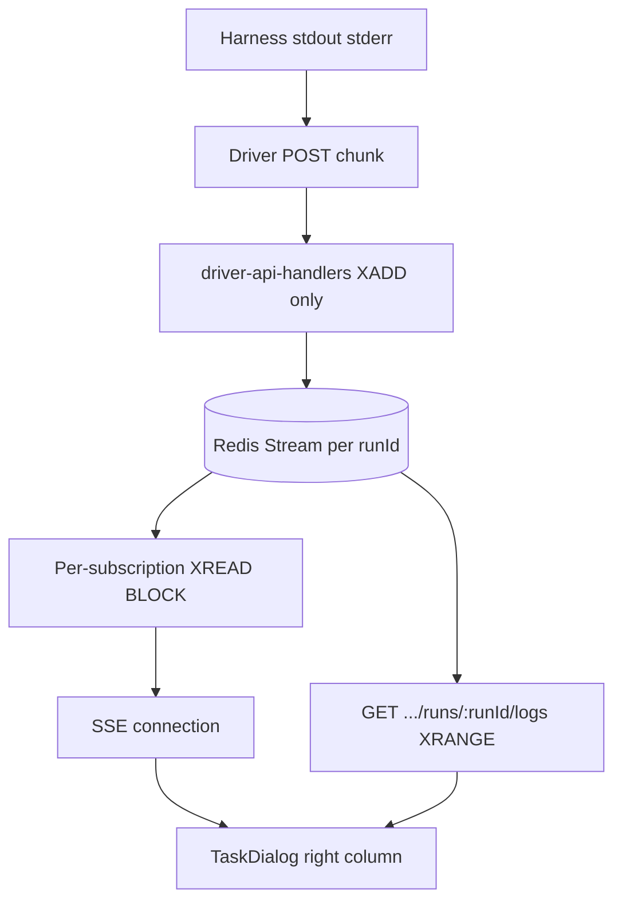

# Executable plan: live agent harness logs (Redis Streams + SSE stream-tail)

## Audience and how to use this document

This file is the **full specification** for implementation. Executing agents do **not** have access to earlier design conversations. If something is ambiguous, prefer the **Concrete specifications** and **Known gaps** sections below rather than asking the product owner, unless a conflict would violate security or destroy data.

Before coding, read repository guidance:

- Root [`AGENTS.md`](../../AGENTS.md) — run `typecheck` and `check` from [`package.json`](../../package.json) before finishing.
- [`apps/server/AGENTS.md`](../../apps/server/AGENTS.md) — wire new services in [`services.ts`](../../apps/server/src/services.ts).
- [`packages/api/AGENTS.md`](../../packages/api/AGENTS.md) — Cerato/Zod conventions.
- [`apps/frontend/AGENTS.md`](../../apps/frontend/AGENTS.md) — React Query, Live Events patterns.

---

## Product requirements (must implement)

1. **Persistence**: Every harness log event from the driver is stored in **Redis Streams** with a **Redis-generated entry ID** (`XADD ... *`). Logs remain queryable after the run finishes (same Redis availability as today). Redis is the **canonical source of truth** — server delivery paths read from the stream, not from in-memory state.
2. **Live updates**: While a user has the relevant UI open, new log lines arrive via **existing workspace SSE** ([`LiveEventsService`](../../apps/server/src/live-events/LiveEventsService.ts)) by **tailing the Redis stream with XREAD**, not by `publish()` from the ingest path.
3. **Subscription scope**: SSE subscription includes **`run-logs:<runId>`** only while the **task dialog** is open ([`TaskDialog open === true`](../../apps/frontend/app/components/tasks/TaskDialog.tsx)) **and** the selected run is **active**. When the dialog closes, the run completes, or the user picks a non-active run, remove that subscription.
4. **History on open**: When opening logs for a run, the client loads **full stream** via an authenticated **HTTP API** (XRANGE-backed), then **merges** with any SSE-delivered lines using **Redis IDs as the dedup key**. Live SSE events render as they arrive; the snapshot is merged in when it returns (no loading gate on live events).
5. **Single-node**: Only one server instance assumed. Each SSE connection that subscribes to `run-logs:<runId>` opens its **own** `XREAD BLOCK` loop on that key (per-subscription reader, not shared).
6. **User-visible logs only**: Ingest **only** the driver POST body ([`driverLogEventSchema`](../../packages/driver-api/src/driver-api.ts): harness stdout/stderr). **Do not** merge Docker [`DockerLoggingService`](../../apps/server/src/sandbox/DockerLoggingService.ts) container logs into this product surface.
7. **Permissions**: Do **not** implement extra log RBAC, retention policies, or encryption beyond existing app security. Still enforce **normal workspace/session rules**: only members of the workspace may subscribe or fetch logs for runs belonging to that workspace.
8. **UI**: TaskDialog gains a **two-column split** — left keeps existing task content, right column has a **run dropdown** (newest first, marks the running run) and a **log panel** below it. Log panel is **stick-to-bottom by default** with detach-on-scroll-up and a "Jump to latest" affordance to re-engage. Empty/loading states are explicit (see spec).

---

## Non-goals (do not implement now)

- Surfacing Docker/sandbox container logs in the UI.
- Per-harness filtering of tool output (secrets, file dumps) — future harness-level concern.
- Multi-instance HA for SSE.
- Custom sequence counters apart from Redis stream IDs.
- Shared XREAD readers multiplexed across multiple subscribers of the same run (per-subscription is the chosen simpler design).
- Stream trimming (`MAXLEN`) or TTL — see Retention.

---

## Current repository facts (do not assume otherwise)

| Fact | Detail |
|------|--------|
| Driver → server | [`apps/driver/src/runtime.ts`](../../apps/driver/src/runtime.ts) forwards harness **stdout/stderr** chunks; [`HostApiClient.sendLog`](../../apps/driver/src/host-api.ts) POSTs to Cerato [`driverApi.internal.driver.runs.:runId.logs`](../../packages/driver-api/src/driver-api.ts). Header [`X-MAL-Driver-Token`](../../packages/driver-api/src/driver-api.ts). |
| Server ingest today | [`driver-api-handlers.ts`](../../apps/server/src/driver-api/driver-api-handlers.ts) validates token via [`DriverRunTokenStore`](../../apps/server/src/driver-api/DriverRunTokenStore.ts), loads [`Run`](../../apps/server/src/runs/RunsService.ts), logs with **logger only** — **no Redis, no SSE**. |
| Internal route wiring | [`apps/server/src/index.ts`](../../apps/server/src/index.ts): `internal: driverApiHandlers` — driver uses **`/api/internal/...`** paths per Cerato merge of [`myAgentLoopApi` + `driverApi`](../../apps/server/src/index.ts). |
| SSE endpoint | GET `/api/workspaces/:workspaceId/live-events` — [`handleLiveEvents`](../../apps/server/src/live-events/live-events-route.ts): **session auth** + workspace membership; subscriptions from repeated query param `subscription=`. |
| Live Events today | [`liveEventDtoSchema`](../../packages/api/src/live-events/index.ts): only `project.updated`, `task.updated`. Matching in [`subscriptionMatchesEvent`](../../apps/server/src/live-events/LiveEventsService.ts). |
| Redis | [`env.REDIS_HOST`](../../apps/server/src/env.ts) required. Already used by [`workflow-queues.ts`](../../apps/server/src/workflow/workflow-queues.ts) (Bull) and [`docker-compose.yml`](../../docker-compose.yml) service `my-agent-loop-redis`. **Reuse the same Redis** for log streams (default: same host/port). |
| Runs API package | [`packages/api/src/runs/runs-api.ts`](../../packages/api/src/runs/runs-api.ts) defines `GET :runId` **but this tree is not mounted** under `workspaces` yet. You must **add** Cerato routes + handlers for log history (see gaps). |
| Task DTO | [`taskDtoSchema`](../../packages/api/src/tasks/tasks-api.ts) has `activeRunState` but **no `runs[]`**. [`toTaskDto`](../../apps/server/src/tasks/tasks-handlers.ts) only passes pending/in_progress state from DB, not run id or run history. |
| `getRunLogs` | [`DatabaseRunsService.getRunLogs`](../../apps/server/src/runs/RunsService.ts) **throws** "not implemented"; comment mentions Redis streams — implement via new Redis adapter or dedicated service. |

---

## Known gaps you must close (critical)

1. **Run history on TaskDto**: The frontend needs the list of runs for a task to populate the right-column dropdown. Today **TaskDto exposes only `activeRunState`** — no run id, no history.
   - Extend `taskDtoSchema` with `runs: Array<{ id: RunId, state: RunState, startedAt: ISODate, finishedAt: ISODate | null }>`, ordered **newest first**. Keep `activeRunState` as-is for backward compatibility.
   - Back this with a new `RunsService` query (or extend [`getActiveRunStatesForTasks`](../../apps/server/src/runs/RunsService.ts)) that returns full run rows for one or many tasks.
   - Frontend uses `runs[0]` as the dropdown default; the entry whose `state` indicates "running" (per existing run-state model) is the currently-active run.
2. **Cerato routes for log history**: Add a **session-authenticated** GET under the **full hierarchy**:
   `GET /api/workspaces/:wsId/projects/:projectId/tasks/:taskId/runs/:runId/logs`
   returning ordered entries `{ id: string, stream: "stdout" | "stderr", message: string }`, backed by **XRANGE**.
   Authorize: user is workspace member **and** the chain `runId → taskId → projectId → workspaceId` matches all four URL segments (join through DB; reject 404 if any segment doesn't line up).
   Update [`packages/api`](../../packages/api) and the appropriate workspaces/projects/tasks child handlers.

> Note: the previous "workspace id resolution in driver handler" gap is **removed** under the stream-tail design — the driver handler does not publish to LiveEvents and never needs `workspaceId`.

---

## Concrete specifications

### Redis

- **Key**: `mal:run:{runId}:logs` (string `runId` as in DB; colon-separated for clarity). Document in code constant.
- **Append**: `XADD mal:run:{runId}:logs * stream <stdout|stderr> message <string>`
- **Read (history)**: `XRANGE mal:run:{runId}:logs - +`; parse Redis reply into `{ id, fields }`.
- **Read (tail)**: `XREAD BLOCK <ms> STREAMS mal:run:{runId}:logs <last-id>` per SSE subscription. Use a non-zero `BLOCK` (e.g. 30000ms) and loop; on each batch, forward entries to the connection and advance `<last-id>`.
- **IDs**: Use **only** Redis-returned IDs for ordering and dedup — **no** manual increment.

**Chunk semantics**: One **XADD per driver POST**, preserving the raw chunk verbatim. Driver POSTs are **not guaranteed line-aligned**. The UI is responsible for partial-line rendering across consecutive entries (no server-side splitting on `\n`).

**Retention**: **No `MAXLEN`, no TTL.** Streams grow until Redis hits its eviction policy. Document this explicitly so the executor does not add a defensive cap.

### Live Events — subscription string

- Parse in [`parseSubscriptionString`](../../packages/api/src/live-events/index.ts): `run-logs:<runId>` where `<runId>` matches [`runIdSchema`](../../packages/api/src/runs/runs-model.ts).
- Extend [`liveSubscriptionSchema`](../../packages/api/src/live-events/index.ts) discriminated union with `{ type: "run-logs", runId: RunId }`.

### Live Events — delivery design (stream-tail, not publish)

The existing in-memory pub/sub in [`LiveEventsService`](../../apps/server/src/live-events/LiveEventsService.ts) continues to handle `project.updated` / `task.updated`. **`run-logs` does not go through `publish()`.** Instead:

- When an SSE connection registers a `run-logs:<runId>` subscription (after authz, see below), open a **per-subscription** `XREAD BLOCK` loop on `mal:run:{runId}:logs`.
- Starting position: client may pass an optional **`lastId`** as part of the subscription query (e.g. `subscription=run-logs:<runId>:<lastId>`) to resume after a known entry; otherwise default to **`$`** (only entries appended after subscribe).
- Each XREAD batch is forwarded to the connection as SSE events of type `run.log.append` with payload `{ runId, entryId, stream, message }`.
- Tear down the loop on connection close, subscription removal, or run completion (an XREAD that has been idle past run end is harmless but should be cleaned up when the connection drops).

**No `publish()` call from the driver handler.** The driver's only job is `XADD`.

### SSE authorization for `run-logs`

In [`handleLiveEvents`](../../apps/server/src/live-events/live-events-route.ts), **after** parsing subscriptions:

- For each `run-logs:<runId>` entry, verify `runId → taskId → projectId → workspaceId` resolves and matches the URL `:workspaceId`.
- If **any** `run-logs` subscription fails authz, **reject the entire connection with 400**. Do not register a connection with partial subscriptions.

### Driver ingest sequence

1. Validate driver token (existing).
2. Load run (existing).
3. **`XADD mal:run:{runId}:logs * stream <s> message <m>`** with the raw POST body.
4. Return success. **Do not** publish to LiveEvents. **Do not** resolve workspaceId.

If Redis fails, respond **5xx** so driver can surface errors.

### Frontend bootstrap algorithm (normative)

Inputs from the right column: `workspaceId`, `projectId`, `taskId`, currently-selected `runId`, and whether that run is **active** (running) or **completed**.

When a `runId` is selected (initial dialog open uses `runs[0]`):

1. **If run is active**: add `run-logs:${runId}` to the SSE subscription list. Render incoming `run.log.append` events into a `liveBuffer: Map<entryId, LogEntry>` and stream them into the panel **as they arrive** (no loading gate).
   **If run is completed**: skip SSE entirely.
2. **In parallel**, fire `GET /api/workspaces/:wsId/projects/:projectId/tasks/:taskId/runs/:runId/logs` (XRANGE). While in-flight, show a **spinner** ("Loading logs…").
3. On snapshot return: build `snapshot: Map<entryId, LogEntry>`, then render the **sorted union** of `snapshot.keys ∪ liveBuffer.keys` ordered by Redis entry ID (lex-sortable within a single stream). Same id from both sources counts **once**.
4. On subsequent SSE events, append only entry ids not already rendered.
5. **Empty / loading states**:
   - XRANGE in flight → spinner ("Loading logs…").
   - XRANGE returned empty AND run is active → "No output yet."
   - XRANGE returned empty AND run is completed → "This run produced no output."
   - Otherwise → render entries.

### Run switching

When the dropdown selection changes:

1. Tear down the current SSE `run-logs` subscription (if any).
2. Reset `liveBuffer`, `snapshot`, scroll state.
3. Re-run the bootstrap algorithm with the new `runId`.

### Log panel scroll behavior

- **Stick-to-bottom by default**: each new entry scrolls the view to the bottom.
- **Detach on user scroll-up**: as soon as the user scrolls away from the bottom, stop auto-scrolling. New entries continue to append below; the visible window stays put.
- **Re-engage**: provide a "Jump to latest" affordance (button visible while detached) **and** auto-re-engage when the user scrolls back to the bottom edge.

### TaskDialog layout

- Two-column split inside [`TaskDialog`](../../apps/frontend/app/components/tasks/TaskDialog.tsx).
- **Left**: existing task content (unchanged).
- **Right**: top is a **run dropdown** populated from `task.runs` (newest first; the running run, if any, is annotated; default selection is `runs[0]`). Below the dropdown is the log panel scoped to the selected `runId`.
- Lift the SSE subscription assembly so the dialog (or its parent) can pass `run-logs:<runId>` into [`LiveEventsProvider`](../../apps/frontend/app/lib/live-events/LiveEventsProvider.tsx). Do **not** open a second EventSource — extend the existing one.

### Observability

- Optional: retain [`logger.info`](../../apps/server/src/driver-api/driver-api-handlers.ts) for ops — not required for product UI.

---

## Suggested parallel workstreams (sub-agents)

1. **Redis + ingest**: Stream service (XADD/XRANGE/XREAD), driver handler XADD-only, unit tests with Redis mock or test container.
2. **API**: `TaskDto.runs[]` + RunsService query, full-hierarchy XRANGE HTTP handler, Cerato schemas.
3. **Live Events**: Subscription parsing for `run-logs[:<lastId>]`, full-hierarchy authz on subscribe, per-subscription XREAD loop wired into the SSE connection lifecycle.
4. **Frontend**: Two-column TaskDialog split, run dropdown, LiveEventsProvider integration, merge algorithm, stick-to-bottom scroll, empty/loading states.

Integrator owns ordering: API shapes (`@mono/api`) before frontend compile.

---

## Verification

From repo root (per AGENTS.md):

```bash
pnpm run typecheck
pnpm run check
```

Add tests following [`apps/server/src/live-events/live-events-route.test.ts`](../../apps/server/src/live-events/live-events-route.test.ts) patterns; extend [`LiveEventsService.test.ts`](../../apps/server/src/live-events/LiveEventsService.test.ts) for `run-logs` subscription matching and the XREAD path.

---

## Summary diagram



---

## Locked product choices (reference)

| Topic | Choice |
|--------|--------|
| Transport | Extend **Live Events SSE** only |
| Persistence | **Redis Streams**, Redis IDs canonical |
| Delivery to SSE | **Per-subscription `XREAD BLOCK`** tailing the stream (not publish) |
| Subscribe | **`run-logs:<runId>`** while task dialog open AND run is active |
| Dedup | By **Redis stream entry ID** |
| Chunking | **One XADD per driver POST** (raw chunk; UI handles partial lines) |
| Retention | **No `MAXLEN`, no TTL** — relies on Redis eviction |
| History API | `GET /api/workspaces/:wsId/projects/:projectId/tasks/:taskId/runs/:runId/logs` |
| Forbidden run-logs sub | **Reject whole SSE connection (400)** |
| TaskDto | Add `runs[]` (newest-first); dropdown defaults to `runs[0]` |
| UI layout | **Two-column TaskDialog**: left = task content, right = run dropdown + log panel |
| Scroll | **Stick-to-bottom**, detach on scroll-up, "Jump to latest" affordance |
| Empty / loading | Spinner while XRANGE in-flight; "No output yet." (active, empty); "This run produced no output." (completed, empty) |
| Container logs | **Out of scope** |

This section duplicates earlier decisions for agents that only read the summary table.
