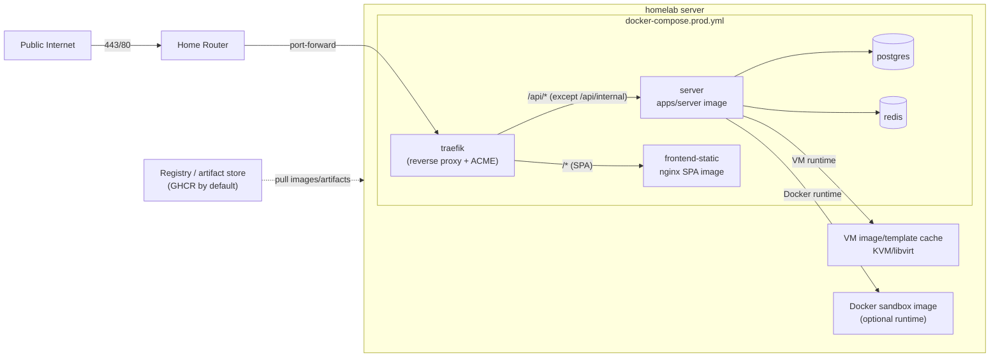

## Goal

Deploy My Agent Loop to a homelab server so it can be used without depending on a laptop checkout, while keeping the day-to-day update loop boring:

- the homelab host runs prebuilt artifacts only;
- frontend, backend, Docker sandbox image, and VM sandbox image/template can be rotated independently;
- Traefik owns public ingress and TLS;
- Postgres and Redis remain separate services with persistent volumes;
- the public surface is the frontend SPA on `/` and the entire `/api/`* tree on the server, with one explicit denial: `/api/internal/*` (driver-host API).

Registry choice should be configurable, but GHCR is a good default for an open source repository. GitHub's current docs say public packages are free, Container Registry storage/bandwidth is currently free, and GHCR stores Docker/OCI images. If this changes later, the deployment should only need image/artifact reference changes rather than a new architecture.

> **Scope note**: This plan includes production deployment support for VM-backed sandboxes because that work is expected to land around the same time. It does not need to design every VM runtime internal from scratch if that is handled by the VM sandbox implementation branch, but production docs/config must treat the VM base image/template as a first-class artifact alongside container images.

## Topology



- Traefik is a separate container and the only service bound to host ports `443` and `80`.
- Postgres, Redis, the server's `PORT` (3000), and the MCP listener (3050) stay on docker/internal networks only.
- The homelab host does not run `pnpm build`, TypeScript compilation, React Router builds, driver SEA builds, or VM image builds during normal updates.
- The production update loop is approximately:

```bash
docker compose --env-file /srv/my-agent-loop/.env -f docker-compose.prod.yml pull
docker compose --env-file /srv/my-agent-loop/.env -f docker-compose.prod.yml up -d
# plus the VM image pull/cache command if the selected VM artifact changed
```

## Design Decisions

### Traefik stays separate from the app container

Use Traefik as its own production service, not embedded in the server/frontend image.

Rationale:

- Traefik owns ports, certificates, ACME storage, redirects, and routing policy; the app owns app logic.
- Traefik can be restarted or upgraded independently from `apps/server`.
- Frontend/backend/sandbox artifacts can rotate without replacing the ingress container.
- The compose file is needed anyway because Postgres and Redis should stay separate.
- Future per-sandbox routing still fits Traefik's dynamic providers without coupling proxy lifecycle to app process lifecycle.

Rejected alternative: putting Traefik/nginx inside a main app container. That might make a single image look simpler, but it makes cert state, process supervision, updates, and future dynamic routing more awkward.

### Prebuilt artifacts only on the homelab host

The homelab server consumes:

- `SERVER_IMAGE`, e.g. `ghcr.io/<owner>/my-agent-loop-server:<git-sha>`
- `FRONTEND_IMAGE`, e.g. `ghcr.io/<owner>/my-agent-loop-frontend:<git-sha>`
- `SANDBOX_DOCKER_IMAGE`, e.g. `ghcr.io/<owner>/my-agent-loop-sandbox:<git-sha>`
- `SANDBOX_VM_IMAGE_REF`, e.g. an OCI artifact reference, object storage URL, or local path managed by the VM sandbox implementation

Use git-SHA tags for traceability. Optionally publish a mutable `stable` tag for convenience, but production docs should show how to pin by digest when you want repeatability.

### GHCR is the default registry candidate, not a hard dependency

Default examples use GHCR because this is a GitHub-hosted open-source project and GHCR supports public anonymous pulls for public container packages. Keep registry values configurable through env vars and docs so another registry can be swapped in later.

VM image artifacts may be pushed as OCI artifacts (for example with ORAS) if the selected registry supports it, or uploaded to object storage if the VM builder already uses that shape. The deployment plan should care about a versioned artifact reference and a host-side cache/update command, not the exact storage backend.

### Sandbox image selection must be configuration, not hardcoded

`DockerSandboxService` currently creates containers with `Image: "my-agent-loop"`. Production must not require retagging a local image by that name.

Add a server env var such as `SANDBOX_DOCKER_IMAGE`, defaulting to `my-agent-loop` for dev. Thread it through service construction into `DockerSandboxService`. The VM sandbox implementation should expose the same kind of explicit runtime image/template configuration, for example `SANDBOX_VM_IMAGE_REF` plus a local cache directory.

### Driver-host traffic stays internal

Driver-host calls from Docker or VM sandboxes must not go through the public Traefik route. Production must set `DRIVER_HOST_API_BASE_URL` and `MCP_SERVER_URL` to whatever private route the selected sandbox runtime uses to reach the server.

This plan should document the chosen Docker network path and the chosen VM host/guest path once the VM runtime implementation lands.

## Public Routing Rules (Traefik)

Implemented in `traefik/dynamic.yml` via the file provider as a tiny set of routers plus one middleware. This intentionally avoids Docker labels, because future runtime targets are not guaranteed to be Docker containers.

- Router `frontend`: `Host(your-domain.com)` (lowest priority) -> `frontend` service (`http://frontend-static:80`).
- Router `api`: `Host(\`your-domain.com\`) && PathPrefix(\`/api\`)` (higher priority than `frontend`) -> `server` service (`http://server:3000`).
- Router `block-internal`: `Host(\`your-domain.com\`) && (Path(\`/api/internal\`) || PathPrefix(\`/api/internal/\`))` (highest priority) -> attaches the `deny-internal` middleware and routes to `server` (the middleware stops the request before it gets there).

The `deny-internal` middleware is an `IPAllowList` with `sourceRange: 127.0.0.1/32`. Any non-loopback request matching the router gets a `403`. Driver-host calls coming from Docker or VM sandboxes must use the direct private path chosen for that runtime.

This is the entire allowlist/denylist surface for the apex hostname. No per-route enumeration. New routes added to `apps/server` automatically become reachable via the public hostname.

## Release And Update Loop

### Build/publish side

Add or document a build/publish path that runs away from the homelab host, either manually from a developer machine or in CI:

1. Build workspace packages and apps.
2. Build the Linux driver binary.
3. Prepare the server deployment artifact.
4. Build frontend static assets.
5. Build and push:
   - server container image;
   - frontend-static container image;
   - Docker sandbox/harness container image.
6. Build and publish the VM sandbox image/template artifact.
7. Emit a release manifest/env file containing the exact image/artifact references for the deployment.

The initial implementation can be a documented manual workflow plus scripts. A GitHub Actions workflow is a reasonable follow-up or part of this plan if it stays small.

### Host side

The homelab host should have:

- `/srv/my-agent-loop/docker-compose.prod.yml`
- `/srv/my-agent-loop/.env` for image refs and runtime env vars
- `/srv/my-agent-loop/traefik/` config
- `/srv/my-agent-loop/letsencrypt/` or a named Docker volume for ACME state
- named Docker volumes for Postgres/Redis
- a VM image/template cache directory, for example `/var/lib/my-agent-loop/vm-images`

The normal update path is:

1. Edit or replace `/srv/my-agent-loop/.env` with the new image/artifact references.
2. Pull the new VM artifact into the host cache if it changed.
3. Run `docker compose --env-file /srv/my-agent-loop/.env -f docker-compose.prod.yml pull`.
4. Run `docker compose --env-file /srv/my-agent-loop/.env -f docker-compose.prod.yml up -d`.
5. Run a short smoke test against the public hostname.

## Files To Change / Add

### New/Update: release artifact scripts or docs

Create a small, explicit release path rather than relying on someone remembering a pile of commands. Prefer scripts in `scripts/` if this becomes executable code. JavaScript build helpers should use JSDoc and `// @ts-check` per `docs/02-coding-practices.md`.

Concrete requirements:

- The release path must produce exact refs for `SERVER_IMAGE`, `FRONTEND_IMAGE`, `SANDBOX_DOCKER_IMAGE`, and `SANDBOX_VM_IMAGE_REF`.
- It must build/publish artifacts off-host.
- It must not require the homelab host to have the repo checkout, pnpm, TypeScript, Vite/React Router build tooling, or driver build tooling.
- It should support GHCR examples but keep registry/image names configurable.

### New: `apps/server/Dockerfile`

Runtime/packaging image only. Do not compile TypeScript, run pnpm builds, or install workspace dependencies inside this Dockerfile. The repository build step should happen before image packaging.

Concrete requirements:

- Add an `@mono/server` `build` script if needed so the app can build itself with a normal package command.
- Add or document a host-side packaging step that prepares an isolated server runtime directory before Docker packaging. Prefer a pnpm-native approach such as `pnpm deploy --filter @mono/server --prod <output-dir>` after `packages/api`, `packages/driver-api`, and `apps/server` have emitted their `dist` artifacts.
- Ensure built workspace package imports resolve in the prepared runtime artifact (`@mono/api` and `@mono/driver-api` must be present as built package artifacts, not source-only path aliases).
- Use `corepack`/pnpm and the root `pnpm-lock.yaml`; do not introduce npm or package-lock usage.
- Expose `3000` (HTTP) and `3050` (MCP, intra-network only).
- Use a small Node 24 runtime image, copy the prepared runtime directory, set `NODE_ENV=production`, and run the built server entrypoint.

### Update: `apps/frontend/Dockerfile`

Replace the existing Dockerfile, which currently assumes npm/package-lock and Node 20, with a runtime/packaging image only. The frontend should build itself outside Docker via the existing React Router build, and the Dockerfile should copy the already-built `apps/frontend/build/client` directory into `nginx:alpine` with an explicit SPA fallback to `index.html`.

Concrete requirements:

- Do not run `pnpm`, `npm`, `react-router build`, or any other build step inside the Dockerfile.
- Run the existing React Router SPA build as a package-level step before Docker packaging (`pnpm --filter @mono/frontend build` or equivalent).
- Copy only static output and nginx config into the final image.
- Add a small nginx config beside the Dockerfile if needed to implement `try_files $uri $uri/ /index.html`.

### Update: root `Dockerfile` and sandbox image config

The root `Dockerfile` remains the Docker sandbox/harness image. It already copies the Linux driver binary from `apps/driver/dist-sea/linux/driver`.

Concrete requirements:

- Keep the Dockerfile focused on sandbox runtime contents.
- Ensure the publish path builds the Linux driver before building the sandbox image.
- Add `SANDBOX_DOCKER_IMAGE` to server env/config and pass it into `DockerSandboxService` instead of hardcoding `Image: "my-agent-loop"`.
- Default `SANDBOX_DOCKER_IMAGE` to `my-agent-loop` in development so existing local workflows keep working.
- Production compose should set `SANDBOX_DOCKER_IMAGE` to the published image ref or digest.

### New/Update: VM sandbox artifact support

Coordinate with the VM sandbox implementation so deployment can rotate VM base images cleanly.

Concrete requirements:

- Document the VM artifact format (for example qcow2/raw template plus metadata) and where it is published.
- Document the host cache directory and ownership/permission requirements.
- Add production env/config for the active VM image/template reference, unless the VM branch has already chosen names.
- The VM runtime should select the image/template by explicit config, not by "latest file in a directory".
- The update docs must describe how to pull/cache a new VM image and how running sandboxes behave during rotation. Prefer: new sandboxes use the new image, existing sandboxes finish on their original image.

### New: `traefik/traefik.yml` (static config)

- Entrypoints `web` (`:80`) and `websecure` (`:443`); HTTP entrypoint redirects to HTTPS.
- File provider pointing at `/etc/traefik/dynamic.yml` for all apex routers, services, and middleware.
- One ACME resolver named `letsencrypt` using the Cloudflare DNS-01 challenge (`dnsChallenge.provider: cloudflare`) with email from `${ACME_EMAIL}`.
- The Cloudflare provider reads `CF_DNS_API_TOKEN` from the environment. Use the scoped token form, not the legacy `CF_API_EMAIL` + `CF_API_KEY` Global API Key variant.

No Docker provider for apex routing. Future sandbox public routing can add a runtime-agnostic provider in a separate plan.

### New: `traefik/dynamic.yml` (file provider)

The middleware (`deny-internal`) and the three apex routers (`block-internal`, `api`, `frontend`) plus the `server` and `frontend` services. Use explicit service URLs over the compose network:

- `server`: `http://server:3000`
- `frontend`: `http://frontend-static:80`

Set explicit priorities so `block-internal` wins over `api`, and `api` wins over `frontend`. Use `Path(\`/api/internal\`) || PathPrefix(\`/api/internal/\`)` for the deny rule so `/api/internalish` is not accidentally blocked.

### New: `docker-compose.prod.yml`

Add a production compose file for the shareable homelab deployment. Keep the existing dev compose behavior unless the implementation has a strong reason to refactor it.

Services:

- `traefik` (`traefik:v3`), ports `80:80` and `443:443`, mounts `traefik.yml`, `dynamic.yml`, and ACME storage; reads `CF_DNS_API_TOKEN` and `ACME_EMAIL`; no Docker socket mount.
- `server`, using `${SERVER_IMAGE}` by default rather than a local `build:` block; depends on Postgres/Redis; no host port binding; joined to internal/proxy networks; no Traefik labels.
- `frontend-static`, using `${FRONTEND_IMAGE}`; joined to proxy network; no Traefik labels.
- `my-agent-loop-db` or `postgres`, with a named production volume.
- `my-agent-loop-redis` or `redis`, with a named production volume.

Production compose should include enough env wiring for `server` to boot without `.env.local`: `DATABASE_URL`, `REDIS_HOST`, `REDIS_PORT`, `APP_BASE_URL`, `MCP_SERVER_URL`, `DRIVER_HOST_API_BASE_URL`, `BETTER_AUTH_SECRET`, `FORGE_ENCRYPTION_KEY`, `OAUTH_CREDENTIALS_ENCRYPTION_KEY`, `SANDBOX_DOCKER_IMAGE`, VM image/template env vars, and optional harness API keys.

The server also needs the runtime access required by the selected sandbox service:

- Docker runtime: Docker socket or a safer Docker API proxy, plus network settings so sandboxes can reach the server privately.
- VM runtime: KVM/libvirt access, VM image cache mount, and whatever bridge/TAP configuration the VM implementation requires.

Be explicit in docs about which privileges are required and why.

### Update: `apps/server/src/env.ts`

- `APP_BASE_URL` currently defaults to `http://localhost:5173`. Production must set it to `https://your-domain.com`; add a comment.
- `MCP_SERVER_URL` and `DRIVER_HOST_API_BASE_URL` currently default to `host.docker.internal`. Document this is a dev-only assumption.
- Add `SANDBOX_DOCKER_IMAGE` with a development default of `my-agent-loop`.
- Add or align VM sandbox env vars with the VM sandbox implementation (`SANDBOX_VM_IMAGE_REF`, cache directory, runtime selector, etc.).
- Keep null/optional handling at the edges; pass required runtime config into sandbox services after env parsing rather than scattering fallback checks inside shared services.

### New: `docs/decisions/reverse-proxy-and-deploy.md`

Per the repo convention in `AGENTS.md`. Captures:

- Why Traefik, and why it is a separate container.
- Why we considered embedding proxying in the app container and decided against it.
- Artifact-based deployment: homelab pulls prebuilt server/frontend/sandbox images and VM artifacts.
- GHCR as the default registry candidate, with registry refs configurable.
- The "deny only `/api/internal/`*" policy and the rationale.
- The Cloudflare DNS-01-for-everything choice.
- Docker and VM sandbox artifact rotation model.
- The runtime-agnostic sandbox routing model for future public sandbox URLs.

### Update: `README.md`

Short "Production deployment" section covering:

- One-time host bootstrap: Docker, compose plugin, KVM/libvirt, directories, firewall, and router port-forward.
- Cloudflare DNS records: apex `A` -> homelab public IP. Wildcard sandbox DNS is deferred until public sandbox routing lands. The apex can stay DNS-only initially; proxy mode is optional and orthogonal.
- Cloudflare API token: created via Cloudflare dashboard with the "Edit zone DNS" template or a custom token granting `Zone:DNS:Edit` on just the relevant zone. Store in `.env` as `CF_DNS_API_TOKEN`. Do not use the Global API Key.
- Registry setup: GHCR examples, public image pulls, and how to override image refs for another registry.
- Required env vars: `SERVER_IMAGE`, `FRONTEND_IMAGE`, `SANDBOX_DOCKER_IMAGE`, VM image refs, `ACME_EMAIL`, `APP_BASE_URL`, `MCP_SERVER_URL`, `DRIVER_HOST_API_BASE_URL`, `BETTER_AUTH_SECRET`, `FORGE_ENCRYPTION_KEY`, `OAUTH_CREDENTIALS_ENCRYPTION_KEY`, `DATABASE_URL`, `REDIS_HOST`, `REDIS_PORT`, and optional harness API keys.
- Build/publish sequence for app images and sandbox artifacts.
- Host update command using `docker compose pull && docker compose up -d`.
- VM image update/cache command once finalized by the VM sandbox implementation.

### New: `.dockerignore`

Add a root `.dockerignore` for Docker packaging contexts. Because Dockerfiles copy prebuilt artifacts instead of building inside containers, this file must not blindly ignore all `dist` or app build output.

Concrete requirements:

- Exclude `node_modules`, `.devloop`, `.git`, local env files, test caches, logs, and unrelated temporary files.
- Keep the prepared server deployment artifact directory available to `apps/server/Dockerfile`.
- Keep `apps/frontend/build/client` available to `apps/frontend/Dockerfile`, or copy it into a dedicated packaging artifact directory that is also available to Docker.
- Keep `apps/driver/dist-sea/linux/driver` available to the root sandbox Dockerfile.
- Be careful with broad patterns like `dist`, `build`, `.react-router`, or dot-prefixed artifact directories. If one is used, add explicit negation rules for the production packaging artifacts.
- Do not exclude files needed by Docker packaging, nginx config, or Traefik config.

## Forward-Looking Public Sandbox Routing (Not Built Here)

Per-sandbox public subdomain routing is still not built in this plan. It remains the future use case that justifies Traefik and DNS-01 from day one.

When sandbox routing actually lands, in a separate plan, the additions will be roughly: a runtime-agnostic routing registry in `apps/server`, a pure Traefik dynamic-config builder, an internal handler such as `GET /api/internal/traefik-config`, an HTTP provider entry in `traefik.yml`, a `*.sandbox.your-domain.com` Cloudflare DNS record, and a sandbox public-domain env var.

## Out Of Scope

- Implementing webhook handlers (`/api/webhooks/github`, `/gitlab`, `/slack`).
- Implementing OAuth provider flows from `docs/ideas/oauth-for-providers.md`.
- Public per-sandbox subdomain routing.
- Hardening beyond the basic route denial (rate limiting, fail2ban, WAF).
- Migrating local dev off `host.docker.internal`.
- Building artifacts on the homelab host during normal updates.

## Verification

- `pnpm typecheck` and `pnpm check` clean.
- Production compose validates with required env vars present:

```bash
docker compose --env-file /srv/my-agent-loop/.env -f docker-compose.prod.yml config
```

- Local smoke test: run the production compose file against locally built/published image refs, with `your-domain.com` in `/etc/hosts` and Traefik configured with the Let's Encrypt staging endpoint or a self-signed default cert.
  - `curl -ki https://your-domain.com/` returns the SPA `index.html`.
  - `curl -ki https://your-domain.com/api/auth/...` reaches the server.
  - `curl -ki https://your-domain.com/api/internal/anything` returns `403` from Traefik.
  - `curl -ki https://your-domain.com/api/internalish` does not match the internal deny router merely because of the prefix-like name.
  - Live event streams still work through Traefik, e.g. the frontend can open `/api/workspaces/:workspaceId/live-events` without buffering-related failure.
  - `curl -ki http://your-domain.com/` redirects to HTTPS.
- Host deploy smoke test:
  - `docker compose --env-file /srv/my-agent-loop/.env -f docker-compose.prod.yml pull` succeeds.
  - `docker compose --env-file /srv/my-agent-loop/.env -f docker-compose.prod.yml up -d` recreates changed services without rebuilding.
  - Starting a Docker sandbox uses `SANDBOX_DOCKER_IMAGE`.
  - Starting a VM sandbox uses the configured VM image/template artifact.
  - Existing sandboxes are not unexpectedly killed by changing the image refs; new sandboxes use the new refs.
  - `nmap` against the host's public IP after deploy shows only `80` and `443`. Postgres (`5432`), Redis (`6379`), Adminer (`8010`), MCP (`3050`), Docker, and libvirt are not publicly reachable.
