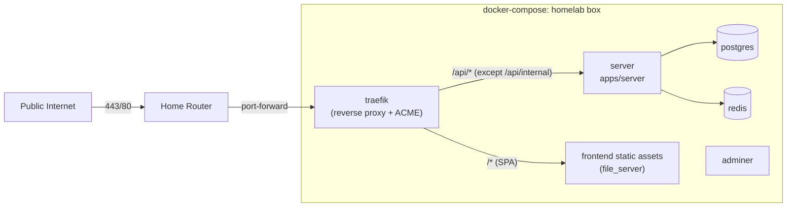

## Goal

Stand up a single public ingress for the agent loop on a homelab box at a domain you own, with **Traefik** doing the reverse proxying. The public surface is the frontend SPA on `/` and the entire `/api/`* tree on the server, with one explicit denial: `/api/internal/*` (driver-host API).

> **Scope note**: Per-sandbox subdomain routing is *not* built in this plan. It's referenced only as the future use case that justifies (a) choosing Traefik over Caddy and (b) using Cloudflare DNS-01 ACME from day one rather than HTTP-01. No code, services, env vars, DNS records, certs, or Traefik providers related to sandbox routing are added here. See "Forward-looking justification" below.

## Topology

- Traefik is the only thing bound to host ports `443` and `80`. Postgres, Redis, Adminer, the server's `PORT` (3000), and the MCP listener (3050) stay on the docker network only.
- TLS via Let's Encrypt: one Traefik ACME resolver using Cloudflare DNS-01 issues a cert for the apex (`your-domain.com`). DNS-01 is chosen now (instead of HTTP-01) so we don't have to switch challenge methods later when wildcard certs are needed for sandbox routing. Side benefit: Cloudflare proxy mode (orange cloud) is then orthogonal to cert issuance.
- Agent sandboxes (spawned by `apps/server` via `dockerode`) reach the server through the shared docker network on `server:3000` / `server:3050` - never through Traefik.

## Public routing rules (Traefik)

Implemented as a tiny set of routers + one middleware. Conceptually:

- Router `frontend`: `Host(\`your-domain.com)`(lowest priority) ->`frontend` service (static file server).
- Router `api`: `Host(\`your-domain.com) && PathPrefix(/api)`(higher priority than`frontend`) ->` server` service.
- Router `block-internal`: `Host(\`your-domain.com) && PathPrefix(/api/internal)`(highest priority) -> attaches the`deny-internal`middleware and routes to`server` (the middleware stops the request before it gets there).

The `deny-internal` middleware is an `IPAllowList` with `sourceRange: 127.0.0.1/32`. Any non-loopback request matching the router gets a `403`. The driver-host calls coming from sandboxes never hit Traefik (they go over the docker network direct to the server), so this loses no real traffic.

This is the entire allowlist/denylist surface for the apex hostname. No per-route enumeration. New routes added to `apps/server` automatically become reachable via the public hostname (intentional, per the user's call to expose admin too).

## Forward-looking justification (NOT BUILT - context only)

Two decisions in this plan look like overkill for "just put a proxy in front of the server" and are worth justifying so a future agent doesn't try to "simplify" them away:

1. **Traefik instead of Caddy.** Both are equally fine for the work that *is* in scope (TLS + a deny rule for `/api/internal/`*). Traefik wins because of a future requirement: an agent running inside a sandbox might spin up a web server, and the operator wants a public URL like `<run-id>.sandbox.your-domain.com` to click around in it. Sandboxes are docker today but [will likely become VMs](docs/ideas/sandboxing-with-vms.md) (Firecracker/Cloud Hypervisor) for snapshotting and stronger isolation, so a docker-label-based discovery scheme is a dead end. Traefik's HTTP provider lets `apps/server` publish a JSON config (regardless of how sandboxes are physically running), which is exactly the runtime-agnostic shape we want. With Caddy, the equivalent is calling its admin API or rebuilding it with custom plugins. None of this code is in this plan - the choice is made now to avoid a swap later.
2. **Cloudflare DNS-01 ACME from day one** (instead of HTTP-01). Wildcard certs require DNS-01. Wildcards aren't needed today, but they will be when sandbox routing ships. Switching ACME methods later would mean re-issuing certs and reconfiguring the resolver. Picking DNS-01 now costs nothing (one Cloudflare API token) and saves that migration. As a free side effect, Cloudflare proxy mode (orange cloud) becomes orthogonal to cert issuance.

When sandbox routing actually lands, in a separate plan, the additions will be roughly: an in-memory `SandboxRoutingRegistry` in `apps/server`, a pure `buildTraefikDynamicConfig` helper, an internal handler `GET /api/internal/traefik-config`, an HTTP provider entry in `traefik.yml`, a `*.sandbox.your-domain.com` Cloudflare DNS record, and a `SANDBOX_PUBLIC_DOMAIN` env var. None of those are added by this plan.

## Files to change / add

### New: `apps/server/Dockerfile`

Multi-stage Node 24 image. Build with pnpm + workspace deps, ship a slim runtime that runs `node dist/index.js` (or `tsx src/index.ts` if a dist build isn't wired up yet). Exposes `3000` (HTTP) and `3050` (MCP, intra-network only). The existing root `Dockerfile` is for the agent sandbox image and stays untouched.

### New: `apps/frontend/Dockerfile`

Multi-stage image whose final layer is the static `build/client` directory. A small `frontend-static` service in compose copies that directory into a named volume that Traefik's file provider serves from, OR runs as a tiny `nginx:alpine` / `caddy` container behind Traefik that serves the SPA with an `index.html` fallback. The latter is simpler to maintain than wiring Traefik directly to a directory; pick `nginx:alpine` with one config file because it's the smallest stable thing.

### New: `traefik/traefik.yml` (static config)

- Entrypoints `web` (`:80`) and `websecure` (`:443`); HTTP entrypoint redirects to HTTPS.
- **Docker provider** with `exposedByDefault: false` for the static apex services (`server`, `frontend-static`).
- **File provider** pointing at `/etc/traefik/dynamic.yml` for the deny-internal middleware.
- One ACME resolver named `letsencrypt` using the Cloudflare DNS-01 challenge (`dnsChallenge.provider: cloudflare`) with email from `${ACME_EMAIL}`. The Cloudflare provider reads `CF_DNS_API_TOKEN` from the environment - we explicitly use the scoped token form, not the legacy `CF_API_EMAIL` + `CF_API_KEY` (Global API Key) variant.

No HTTP provider, no Redis provider. The forward-looking sandbox-routing use case is handled in a future plan.

### New: `traefik/dynamic.yml` (file provider)

The middleware (`deny-internal`) and the three apex routers (`block-internal`, `api`, `frontend`) plus the `server` and `frontend` services. Anything for sandboxes is delivered via docker labels at runtime, not in this file.

### Update: `docker-compose.yml`

Add services:

- `traefik` (image `traefik:v3`, ports `80:80` and `443:443`, mounts `/var/run/docker.sock:ro`, `traefik.yml`, `dynamic.yml`, and a `letsencrypt` volume for `acme.json`; reads `CF_DNS_API_TOKEN` and `ACME_EMAIL` from the environment).
- `server` (built from `apps/server/Dockerfile`, depends on `my-agent-loop-db` and `my-agent-loop-redis`, env from compose, NOT exposing host ports, joined to the shared `proxy` network, carries Traefik labels for the apex routes).
- `frontend-static` (small nginx-alpine container with the SPA + index.html fallback, joined to `proxy`, carries Traefik labels for `Host(\`your-domain.com)` with priority lower than the API router).
- Remove host port bindings on `my-agent-loop-db` (`5432`), `my-agent-loop-redis` (`6379`), and `adminer` (`8010`). Move those into a new `docker-compose.dev.yml` override so local dev still gets `localhost:5432` etc.

### New: `apps/server/src/sandbox-routing/` (runtime-agnostic registry + helper)

A small new domain folder (per `docs/02-coding-practices.md`) containing:

- `SandboxRoutingRegistry.ts` - an in-memory `Map<RunId, { address: string; port: number }>` with `register`, `unregister`, `list` methods. Wired into `services.ts` like every other service.
- `buildTraefikDynamicConfig.ts` - a pure function from `Array<{ runId, address, port }>` to the Traefik dynamic-config shape. Pure, easily unit-tested per the "DTO / transformation functions must be pure" rule.
- `sandbox-routing-handlers.ts` - the `GET /api/internal/traefik-config` handler that calls the registry + builder. Wired into `apps/server/src/index.ts` under the existing `internal` handler bag.
- Colocated tests (`*.test.ts`) for the builder and the registry.

No `register` call sites yet - the registry stays empty until the follow-up plan integrates with sandbox lifecycle. The endpoint just serves the empty config, which keeps Traefik's HTTP provider happy.

### Apex routes for `server` and `frontend-static`

Defined via Traefik docker labels in `docker-compose.yml` (these services are *always* docker, unlike sandboxes). Both labeled with `Host(\`your-domain.com)`, the API router with higher priority and a` PathPrefix(/api)`matcher, the frontend with the catch-all. The`block-internal`router for`/api/internal/`*lives in`traefik/dynamic.yml` (file provider) so it's not tangled into the server's own labels.

### Update: `apps/server/src/env.ts`

- `APP_BASE_URL` currently defaults to `http://localhost:5173`. In production this must be set to `https://your-domain.com`. Add a comment.
- `MCP_SERVER_URL` and `DRIVER_HOST_API_BASE_URL` currently default to `host.docker.internal`. Document this is a dev-only assumption; in compose the server overrides these to `http://server:3050` / `http://server:3000` (or the appropriate gateway address) so that sandbox containers on the docker network can reach the server.
- Add `SANDBOX_PUBLIC_DOMAIN` (e.g. `sandbox.your-domain.com`). Used by the route-builder to construct `Host()` matchers. No flag needed to enable the HTTP provider endpoint itself - it just returns an empty config when nothing is registered.

### New: `docs/decisions/reverse-proxy.md`

Per the repo convention in `AGENTS.md`. Captures:

- Why Traefik (multiple providers including a server-driven HTTP provider, native Let's Encrypt with DNS-01, fits dynamic per-sandbox routing without custom plugins).
- Why we considered Caddy and decided against it: dynamic routing for sandboxes would require either calling Caddy's admin API from the server or rebuilding Caddy with custom plugins.
- The "deny only `/api/internal/`*" policy and the rationale (operator owns one denylist entry, every other route is intentionally public; admin endpoints exposed deliberately for now).
- The Cloudflare DNS-01-for-everything choice: we need DNS-01 for the wildcard anyway, so use it for the apex too to keep a single resolver and credential, and so Cloudflare proxy mode stays orthogonal to cert issuance.
- The runtime-agnostic sandbox routing model: server publishes a Traefik dynamic-config document over an internal HTTP endpoint; Traefik polls it. Works for docker today, VMs (per `docs/ideas/sandboxing-with-vms.md`) tomorrow, and remote hosts in principle. We explicitly chose this over Traefik's docker-label provider so that the proxy layer never needs to learn about new sandbox runtimes.
- **Alternatives considered for the sandbox routing channel** (recorded so a future agent doesn't redo the analysis):
  - **Redis KV provider** (Traefik watches keys via Redis pub/sub for sub-second push-like updates). Reuses the existing Redis instance in compose and is genuinely push-shaped. Rejected because it bakes Traefik's KV key schema into the server as a Traefik-version-specific ABI, and because it makes sandbox routing depend on Redis health. Reconsider if registration latency or churn ever becomes a real constraint.
  - **File provider with inotify watch** (server writes YAML to a shared volume, Traefik reloads on change). Same JSON-ish schema as the HTTP provider, but requires a shared volume between containers and atomic temp-file-then-rename writes. Rejected as the messiest of the three with no upside over the HTTP provider for our latency needs.
  - **Caddy admin API push** (Caddy alternative). Rejected as part of the broader Caddy-vs-Traefik decision above.

### Update: `README.md`

Short "Production deployment" section covering:

- Router port-forward (80/443) on the homelab box.
- Cloudflare DNS records: apex `A` -> homelab public IP, `*.sandbox.<domain>` `A` (or `CNAME` to apex) -> same IP. Both can stay DNS-only (grey cloud) initially; proxy (orange cloud) is optional and orthogonal.
- Cloudflare API token: created via Cloudflare dashboard with the **"Edit zone DNS"** template (or a custom token granting `Zone:DNS:Edit` on just the relevant zone). Stored in `.env` as `CF_DNS_API_TOKEN`. Do *not* use the Global API Key.
- `ACME_EMAIL`, `APP_BASE_URL`, `MCP_SERVER_URL`, `DRIVER_HOST_API_BASE_URL`, `SANDBOX_PUBLIC_DOMAIN`, `BETTER_AUTH_SECRET`, `FORGE_ENCRYPTION_KEY`, `DATABASE_URL`, `REDIS_HOST` env vars listed.
- `docker compose up --build`.

## Out of scope (intentionally)

- Implementing the actual webhook handlers (`/api/webhooks/github`, `/gitlab`, `/slack`). They are reachable through the proxy as soon as the Hono routes exist; that's a separate plan.
- Implementing the OAuth provider flows from `docs/ideas/oauth-for-providers.md`. Better Auth's existing `/api/auth/`* is what the proxy exposes today.
- The full per-sandbox routing UX (operator UI, lifecycle, auth gating). This plan only adds the label-helper and the flag.
- Hardening (rate limiting, fail2ban, WAF). Traefik supports rate limiting via middleware; add once there's measurable abuse.
- Switching the agent sandbox networking off `host.docker.internal` for dev. The plan only changes the production compose values; local dev keeps working as-is.

## Verification

- `pnpm typecheck` and `pnpm check` clean.
- Local smoke test: `docker compose up --build` on a workstation with `your-domain.com` in `/etc/hosts`, Traefik configured with the Let's Encrypt staging endpoint (or a self-signed default cert).
  - `curl -ki https://your-domain.com/` returns the SPA `index.html`.
  - `curl -ki https://your-domain.com/api/auth/...` reaches the server.
  - `curl -ki https://your-domain.com/api/internal/anything` returns `403` from Traefik.
  - `curl -ki http://your-domain.com/` redirects to HTTPS.
- `nmap` against the host's public IP after deploy shows only `80` and `443`. Postgres (`5432`), Redis (`6379`), Adminer (`8010`), and MCP (`3050`) are not reachable.
- After manually calling `SandboxRoutingRegistry.register({ runId: "test", address: "<reachable-ip>", port: 3000 })` against a test upstream, `curl -ki https://test.sandbox.your-domain.com/` reaches that upstream within ~2s (one HTTP-provider poll). Works whether the upstream is a docker container, a VM, or anything else with an IP.

