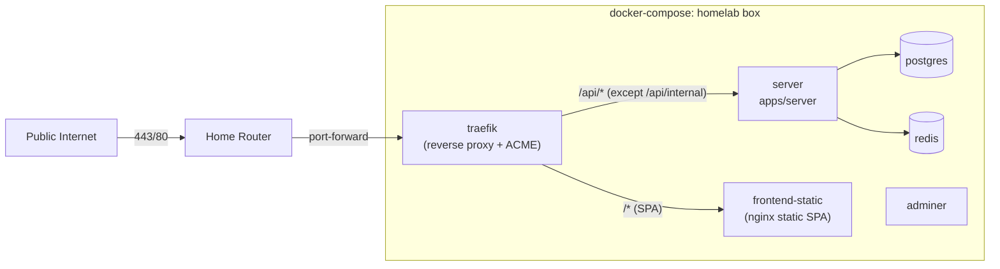

## Goal

Stand up a single public ingress for the agent loop on a homelab box at a domain you own, with **Traefik** doing the reverse proxying. The public surface is the frontend SPA on `/` and the entire `/api/`* tree on the server, with one explicit denial: `/api/internal/*` (driver-host API).

> **Scope note**: Per-sandbox subdomain routing is *not* built in this plan. It's referenced only as the future use case that justifies (a) choosing Traefik over Caddy and (b) using Cloudflare DNS-01 ACME from day one rather than HTTP-01. No code, services, env vars, DNS records, certs, or Traefik providers related to sandbox routing are added here. See "Forward-looking justification" below.

## Topology

- Traefik is the only thing bound to host ports `443` and `80`. Postgres, Redis, Adminer, the server's `PORT` (3000), and the MCP listener (3050) stay on docker networks only.
- TLS via Let's Encrypt: one Traefik ACME resolver using Cloudflare DNS-01 issues a cert for the apex (`your-domain.com`). DNS-01 is chosen now (instead of HTTP-01) so we don't have to switch challenge methods later when wildcard certs are needed for sandbox routing. Side benefit: Cloudflare proxy mode (orange cloud) is then orthogonal to cert issuance.
- Agent sandboxes (spawned by `apps/server` via `dockerode`) must reach the server directly, never through Traefik. The exact production network path for sandboxes is a remaining design question for this plan because the current `DockerSandboxService` does not explicitly attach created containers to the compose network.

## Public routing rules (Traefik)

Implemented in `traefik/dynamic.yml` via the file provider as a tiny set of routers + one middleware. This intentionally avoids Docker labels, because future runtime targets are not guaranteed to be Docker containers. Conceptually:

- Router `frontend`: `Host(\`your-domain.com\`)` (lowest priority) -> `frontend` service (`http://frontend-static:80`).
- Router `api`: `Host(\`your-domain.com\`) && PathPrefix(\`/api\`)` (higher priority than `frontend`) -> `server` service (`http://server:3000`).
- Router `block-internal`: `Host(\`your-domain.com\`) && (Path(\`/api/internal\`) || PathPrefix(\`/api/internal/\`))` (highest priority) -> attaches the `deny-internal` middleware and routes to `server` (the middleware stops the request before it gets there).

The `deny-internal` middleware is an `IPAllowList` with `sourceRange: 127.0.0.1/32`. Any non-loopback request matching the router gets a `403`. Driver-host calls coming from sandboxes must never hit Traefik; they should use the direct server path chosen when the sandbox-network question is resolved.

This is the entire allowlist/denylist surface for the apex hostname. No per-route enumeration. New routes added to `apps/server` automatically become reachable via the public hostname (intentional, per the user's call to expose admin too).

## Forward-looking justification (NOT BUILT - context only)

Two decisions in this plan look like overkill for "just put a proxy in front of the server" and are worth justifying so a future agent doesn't try to "simplify" them away:

1. **Traefik instead of Caddy.** Both are equally fine for the work that *is* in scope (TLS + a deny rule for `/api/internal/`*). Traefik wins because of a future requirement: an agent running inside a sandbox might spin up a web server, and the operator wants a public URL like `<run-id>.sandbox.your-domain.com` to click around in it. Sandboxes are docker today but [will likely become VMs](docs/ideas/sandboxing-with-vms.md) (Firecracker/Cloud Hypervisor) for snapshotting and stronger isolation, so a docker-label-based discovery scheme is a dead end. Traefik's HTTP provider lets `apps/server` publish a JSON config (regardless of how sandboxes are physically running), which is exactly the runtime-agnostic shape we want. With Caddy, the equivalent is calling its admin API or rebuilding it with custom plugins. None of this code is in this plan - the choice is made now to avoid a swap later.
2. **Cloudflare DNS-01 ACME from day one** (instead of HTTP-01). Wildcard certs require DNS-01. Wildcards aren't needed today, but they will be when sandbox routing ships. Switching ACME methods later would mean re-issuing certs and reconfiguring the resolver. Picking DNS-01 now costs nothing (one Cloudflare API token) and saves that migration. As a free side effect, Cloudflare proxy mode (orange cloud) becomes orthogonal to cert issuance.

When sandbox routing actually lands, in a separate plan, the additions will be roughly: a runtime-agnostic routing registry in `apps/server`, a pure Traefik dynamic-config builder, an internal handler such as `GET /api/internal/traefik-config`, an HTTP provider entry in `traefik.yml`, a `*.sandbox.your-domain.com` Cloudflare DNS record, and a sandbox public-domain env var. None of those are added by this plan.

## Files to change / add

### New: `apps/server/Dockerfile`

Runtime/packaging image only. Do not compile TypeScript, run pnpm builds, or install workspace dependencies inside this Dockerfile. The repository build step should happen before `docker compose up --build`, with each package/app building itself independently. The Dockerfile should copy an already-prepared server deployment artifact into a slim Node 24 runtime image and run built JavaScript.

Concrete requirements:

- Add an `@mono/server` `build` script if needed so the app can build itself with a normal package command.
- Add or document a host-side packaging step that prepares an isolated server runtime directory before Docker packaging. Prefer a pnpm-native approach such as `pnpm deploy --filter @mono/server --prod <output-dir>` after `packages/api`, `packages/driver-api`, and `apps/server` have emitted their `dist` artifacts.
- Ensure built workspace package imports resolve in the prepared runtime artifact (`@mono/api` and `@mono/driver-api` must be present as built package artifacts, not source-only path aliases).
- Use `corepack`/pnpm and the root `pnpm-lock.yaml`; do not introduce npm or package-lock usage.
- Expose `3000` (HTTP) and `3050` (MCP, intra-network only).
- The Dockerfile should be small and boring: `FROM node:24-slim` (or an equivalent Node 24 runtime), `COPY` the prepared runtime directory, set `NODE_ENV=production`, and run the built server entrypoint.
- Keep the existing root `Dockerfile` untouched; it builds the agent sandbox image.

### Update: `apps/frontend/Dockerfile`

Replace the existing Dockerfile, which currently assumes npm/package-lock and Node 20, with a runtime/packaging image only. The frontend should build itself outside Docker via the existing React Router build, and the Dockerfile should copy the already-built `apps/frontend/build/client` directory into `nginx:alpine` with an explicit SPA fallback to `index.html`.

Concrete requirements:

- Do not run `pnpm`, `npm`, `react-router build`, or any other build step inside the Dockerfile.
- Run the existing React Router SPA build as a host-side/package-level step before Docker packaging (`pnpm --filter @mono/frontend build` or equivalent).
- Copy only static output and nginx config into the final image.
- Add a small nginx config beside the Dockerfile if needed to implement `try_files $uri $uri/ /index.html`.

### New: `traefik/traefik.yml` (static config)

- Entrypoints `web` (`:80`) and `websecure` (`:443`); HTTP entrypoint redirects to HTTPS.
- **File provider** pointing at `/etc/traefik/dynamic.yml` for all apex routers, services, and middleware.
- One ACME resolver named `letsencrypt` using the Cloudflare DNS-01 challenge (`dnsChallenge.provider: cloudflare`) with email from `${ACME_EMAIL}`. The Cloudflare provider reads `CF_DNS_API_TOKEN` from the environment - we explicitly use the scoped token form, not the legacy `CF_API_EMAIL` + `CF_API_KEY` (Global API Key) variant.

No Docker provider, no HTTP provider, no Redis provider. The forward-looking sandbox-routing use case is handled in a future plan.

### New: `traefik/dynamic.yml` (file provider)

The middleware (`deny-internal`) and the three apex routers (`block-internal`, `api`, `frontend`) plus the `server` and `frontend` services. Use explicit service URLs over the compose network:

- `server`: `http://server:3000`
- `frontend`: `http://frontend-static:80`

Set explicit priorities so `block-internal` wins over `api`, and `api` wins over `frontend`. Use `Path(\`/api/internal\`) || PathPrefix(\`/api/internal/\`)` for the deny rule so `/api/internalish` is not accidentally blocked.

### Update: `docker-compose.yml`

Add services:

- `traefik` (image `traefik:v3`, ports `80:80` and `443:443`, mounts `traefik.yml`, `dynamic.yml`, and a `letsencrypt` volume for `acme.json`; reads `CF_DNS_API_TOKEN` and `ACME_EMAIL` from the environment). Do not mount `/var/run/docker.sock`; this plan does not use the Docker provider.
- `server` (built from `apps/server/Dockerfile`, depends on `my-agent-loop-db` and `my-agent-loop-redis`, env from compose, NOT exposing host ports, joined to the internal app network and the shared proxy network, no Traefik labels).
- `frontend-static` (small nginx-alpine container with the SPA + index.html fallback, joined to `proxy`, no Traefik labels).
- Remove host port bindings on `my-agent-loop-db` (`5432`), `my-agent-loop-redis` (`6379`), and `adminer` (`8010`). Move those into a new `docker-compose.dev.yml` override so local dev still gets `localhost:5432` etc.

Production compose should include enough env wiring for `server` to boot without `.env.local`: `DATABASE_URL`, `REDIS_HOST`, `APP_BASE_URL`, `MCP_SERVER_URL`, `DRIVER_HOST_API_BASE_URL`, `BETTER_AUTH_SECRET`, `FORGE_ENCRYPTION_KEY`, and optional harness API keys. The server also needs whatever Docker access is required for the existing sandbox service (likely the Docker socket), but sandbox network routing remains a follow-up discussion item.

Use named production volumes for Postgres/Redis data rather than `.devloop` paths. Keep `.devloop` for local development only.

Because Dockerfiles are packaging-only, `docker compose up --build` should be documented as requiring the host-side build/package step to have run first. Do not hide TypeScript or React builds inside `docker compose`.

### Update: `apps/server/src/env.ts`

- `APP_BASE_URL` currently defaults to `http://localhost:5173`. In production this must be set to `https://your-domain.com`. Add a comment.
- `MCP_SERVER_URL` and `DRIVER_HOST_API_BASE_URL` currently default to `host.docker.internal`. Document this is a dev-only assumption. The production values depend on the sandbox-network decision that still needs to be made.

### New: `docs/decisions/reverse-proxy.md`

Per the repo convention in `AGENTS.md`. Captures:

- Why Traefik (file provider now, future server-driven HTTP provider, native Let's Encrypt with DNS-01, fits dynamic per-sandbox routing without custom plugins).
- Why we considered Caddy and decided against it: dynamic routing for sandboxes would require either calling Caddy's admin API from the server or rebuilding Caddy with custom plugins.
- The "deny only `/api/internal/`*" policy and the rationale (operator owns one denylist entry, every other route is intentionally public; admin endpoints exposed deliberately for now).
- The Cloudflare DNS-01-for-everything choice: we need DNS-01 for the wildcard anyway, so use it for the apex too to keep a single resolver and credential, and so Cloudflare proxy mode stays orthogonal to cert issuance.
- The runtime-agnostic sandbox routing model: server publishes a Traefik dynamic-config document over an internal HTTP endpoint; Traefik polls it. Works for docker today, VMs (per `docs/ideas/sandboxing-with-vms.md`) tomorrow, and remote hosts in principle. We explicitly chose this over Traefik's docker-label provider so that the proxy layer never needs to learn about new sandbox runtimes.
- **Alternatives considered for the sandbox routing channel** (recorded so a future agent doesn't redo the analysis):
  - **Redis KV provider** (Traefik watches keys via Redis pub/sub for sub-second push-like updates). Reuses the existing Redis instance in compose and is genuinely push-shaped. Rejected because it bakes Traefik's KV key schema into the server as a Traefik-version-specific ABI, and because it makes sandbox routing depend on Redis health. Reconsider if registration latency or churn ever becomes a real constraint.
  - **File provider with inotify watch** (server writes YAML to a shared volume, Traefik reloads on change). Same JSON-ish schema as the HTTP provider, but requires a shared volume between containers and atomic temp-file-then-rename writes. Rejected as the messiest of the three with no upside over the HTTP provider for our latency needs.
  - **Caddy admin API push** (Caddy alternative). Rejected as part of the broader Caddy-vs-Traefik decision above.

### Update: `README.md`

Short "Production deployment" section covering:

- Router port-forward (80/443) on the homelab box.
- Cloudflare DNS records: apex `A` -> homelab public IP. Wildcard sandbox DNS is deferred until sandbox routing lands. The apex can stay DNS-only (grey cloud) initially; proxy (orange cloud) is optional and orthogonal.
- Cloudflare API token: created via Cloudflare dashboard with the **"Edit zone DNS"** template (or a custom token granting `Zone:DNS:Edit` on just the relevant zone). Stored in `.env` as `CF_DNS_API_TOKEN`. Do *not* use the Global API Key.
- `ACME_EMAIL`, `APP_BASE_URL`, `MCP_SERVER_URL`, `DRIVER_HOST_API_BASE_URL`, `BETTER_AUTH_SECRET`, `FORGE_ENCRYPTION_KEY`, `DATABASE_URL`, `REDIS_HOST`, and optional harness API key env vars listed.
- Build/package sequence: run type/package builds on the host first, with each package/app owning its own build output, then run Docker packaging. For example: build workspace packages and apps, prepare a dedicated server deployment artifact directory, build the frontend static assets, verify those artifact paths are included by `.dockerignore`, then run `docker compose up --build`.
- `docker compose up --build`.

### New: `.dockerignore`

Add a root `.dockerignore` for Docker packaging contexts. Because Dockerfiles copy prebuilt artifacts instead of building inside containers, this file must not blindly ignore all `dist` or app build output. It should exclude local state and heavyweight caches while explicitly allowing the paths that packaging images need.

Concrete requirements:

- Exclude `node_modules`, `.devloop`, `.git`, local env files, test caches, logs, and unrelated temporary files.
- Keep the prepared server deployment artifact directory available to `apps/server/Dockerfile`.
- Keep `apps/frontend/build/client` available to `apps/frontend/Dockerfile`, or copy it into a dedicated packaging artifact directory that is also available to Docker.
- Be careful with broad patterns like `dist`, `build`, `.react-router`, or dot-prefixed artifact directories. If one is used, add explicit negation rules for the production packaging artifacts.
- Do not exclude files needed by Docker packaging, such as nginx/Traefik config files.

## Out of scope (intentionally)

- Implementing the actual webhook handlers (`/api/webhooks/github`, `/gitlab`, `/slack`). They are reachable through the proxy as soon as the Hono routes exist; that's a separate plan.
- Implementing the OAuth provider flows from `docs/ideas/oauth-for-providers.md`. Better Auth's existing `/api/auth/`* is what the proxy exposes today.
- All per-sandbox public routing work: registry, route-builder, HTTP provider endpoint, wildcard DNS, sandbox public-domain env vars, operator UI, lifecycle integration, auth gating, and verification of sandbox subdomains.
- Hardening (rate limiting, fail2ban, WAF). Traefik supports rate limiting via middleware; add once there's measurable abuse.
- Switching the agent sandbox networking off `host.docker.internal` for dev. Local dev keeps working as-is.

## Verification

- `pnpm typecheck` and `pnpm check` clean.
- Local smoke test: `docker compose up --build` on a workstation with `your-domain.com` in `/etc/hosts`, Traefik configured with the Let's Encrypt staging endpoint (or a self-signed default cert).
  - `curl -ki https://your-domain.com/` returns the SPA `index.html`.
  - `curl -ki https://your-domain.com/api/auth/...` reaches the server.
  - `curl -ki https://your-domain.com/api/internal/anything` returns `403` from Traefik.
  - `curl -ki https://your-domain.com/api/internalish` does not match the internal deny router merely because of the prefix-like name.
  - Live event streams still work through Traefik, e.g. the frontend can open `/api/workspaces/:workspaceId/live-events` without buffering-related failure.
  - `curl -ki http://your-domain.com/` redirects to HTTPS.
- `nmap` against the host's public IP after deploy shows only `80` and `443`. Postgres (`5432`), Redis (`6379`), Adminer (`8010`), and MCP (`3050`) are not reachable.
